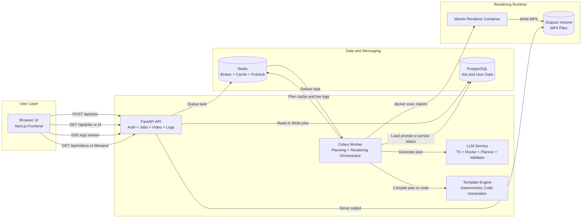
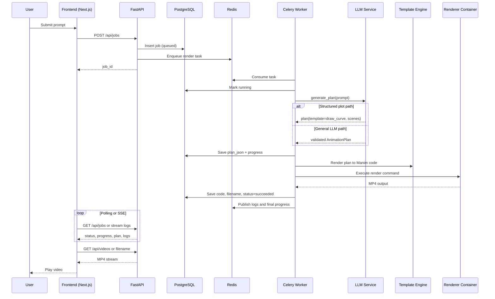
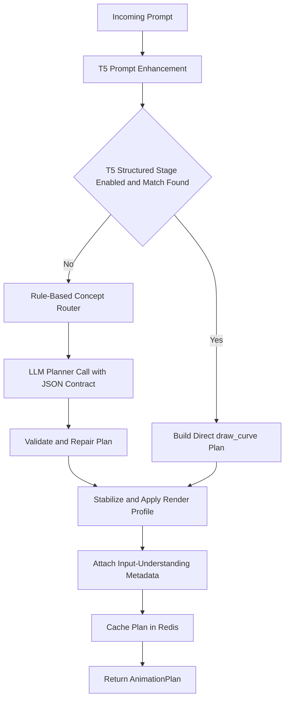
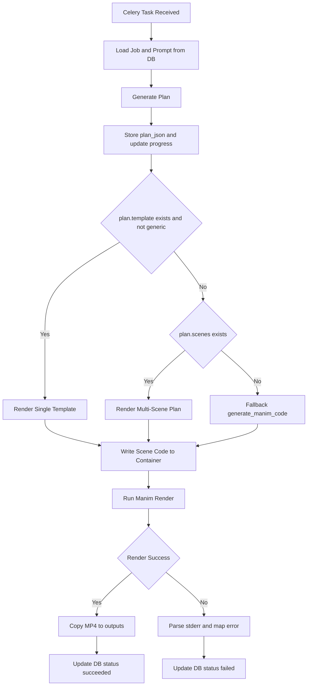
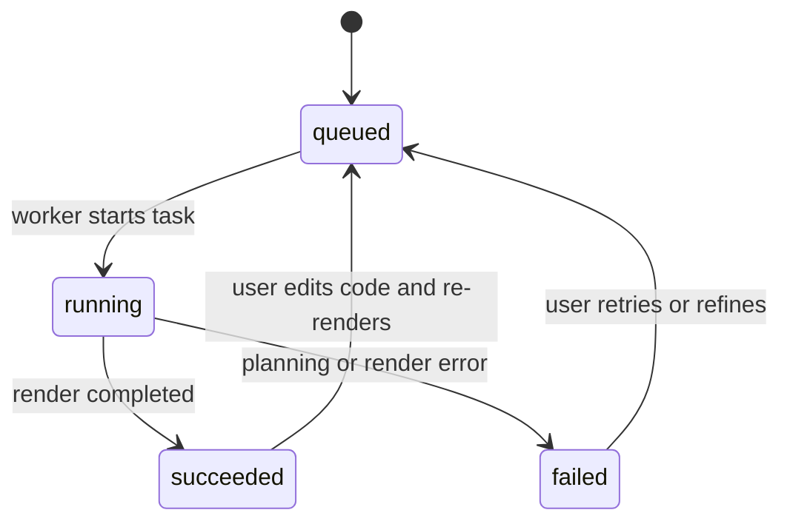

# Anima Studio: Full Project Implementation, Architecture, and Flow

## 1) Project Purpose
Anima Studio is an AI-assisted animation platform that turns natural-language educational prompts into rendered Manim videos.

Core objective:
- Accept a user prompt.
- Plan the animation as structured JSON (AnimationPlan).
- Convert the plan into deterministic Manim code through rendering.
- Render MP4 output asynchronously in a dedicated renderer container.

## 2) Implementation Stack

Frontend:
- Next.js 14 (App Router), TypeScript, Tailwind, shadcn/ui.

Backend:
- FastAPI + Uvicorn.
- SQLAlchemy async + PostgreSQL.
- Pydantic schemas for API and planning contracts.
- Redis for queue broker, result backend, log pub/sub, and plan cache.
- Celery workers for asynchronous rendering.

AI + Planning:
- Gemini/OpenAI-compatible planner path.
- Mandatory T5 preprocessing and structured stage for stronger prompt understanding.

Rendering:
- Manim in isolated Docker container.

Deployment:
- Docker Compose with services for postgres, redis, api, worker, manim-renderer, and frontend.

## 3) High-Level Runtime Architecture

User Browser (Next.js)
  -> FastAPI API (Auth + Jobs)
  -> PostgreSQL (job state, plan_json, logs references)
  -> Redis (rate limit, Celery broker/backend, stream logs, planner cache)
  -> Celery Worker (orchestrates planning and rendering)
  -> Manim Renderer Container (executes code, outputs MP4)
  -> Shared outputs volume (served back by API)

### 3.1) Architecture Diagram (Mermaid)

## 4) Main Modules and Responsibilities

Frontend UI and API client:
- frontend/app/page.tsx: prompt input, job polling, blueprint/script/log tabs, playback, and edit flow.
- frontend/lib/api.ts: Axios client, token injection, auth/job API wrappers.
- frontend/context/AuthContext.tsx: login session state.

API and routing:
- backend/app/main.py: app bootstrap, CORS, global exception handlers, rate-limit middleware for POST /api/jobs.
- backend/app/api/routes.py: job CRUD-style endpoints, refinement endpoint, video serving, SSE log stream endpoint.
- backend/app/api/auth.py: register/login/me with JWT workflow.

Data layer:
- backend/app/models/job.py: Job entity (prompt, status, plan_json, code, logs, error, progress, video_filename, owner_id).
- backend/app/models/user.py: User entity and relation to jobs.
- backend/app/schemas/job.py: request/response contracts.
- backend/app/schemas/animation.py: AnimationPlan, AnimationScene, AnimationObject, AnimationStep contracts and utilities.

Planning and intent:
- backend/app/services/llm.py:
  - Prompt enhancement with T5.
  - Structured T5 plot path (draw_curve-style extraction for equation/range-like prompts).
  - Rule-based concept router + LLM planner.
  - Validation/repair/stabilization and render profile enrichment.
  - Plan metadata attachment for input-understanding diagnostics.
  - Redis plan cache.

Template engine:
- backend/app/templates/engine.py: template registry, single-template rendering, multi-scene rendering.
- backend/app/templates/base.py: shared template contract and style/render param handling.
- backend/app/templates/generic.py: safe generic fallback interpreter.
- backend/app/templates/primitives.py and domain folders: concrete reusable templates.

Async rendering worker:
- backend/app/worker/celery_app.py: Celery app config and runtime limits.
- backend/app/worker/tasks.py:
  - render_graph_task for normal prompt flow.
  - render_custom_code_task for user-edited code flow.
  - Docker execution, output copy, status/progress/log updates.

Infrastructure:
- docker-compose.yml: all service wiring and volumes.
- backend/app/core/config.py: environment-driven settings.

## 5) End-to-End Flow (Prompt to Video)

1. User authentication:
- User registers/logs in via /api/auth/register and /api/auth/login.
- Frontend stores token and sends Bearer auth on subsequent requests.

2. Job creation:
- Frontend calls POST /api/jobs with prompt.
- API creates Job in queued state and dispatches Celery task render_graph_task(job_id).

3. Worker picks task:
- Worker marks job running.
- Loads prompt from DB.
- Publishes live log messages through Redis pub/sub channel logs:{job_id}.

4. Plan generation (LLM pipeline):
- T5 preprocesses/enhances prompt.
- Optional structured T5 stage can produce direct draw_curve plan for equation-like prompts.
- If not resolved directly, planner calls LLM with strict JSON planning prompt.
- Router hints template choice; validator/repair step enforces safer plan output.
- Plan gets stored into job.plan_json and cached in Redis.

5. Manim code generation:
- Template-first path: if plan.template exists and is non-generic, render that template directly.
- Scene path: if scenes exist, render multi-scene plan.
- Fallback path: direct generic generation if needed.

6. Rendering inside renderer container:
- Worker writes scene code to /manim/scene.py in container.
- Runs manim command with detected Scene class.
- Copies generated MP4 from /manim/media to /manim/outputs.
- Writes code/logs/video filename and updates progress/status in DB.

7. Frontend status and playback:
- Frontend polls /api/jobs/{id} for status/progress/plan/code/error.
- Optional SSE from /api/jobs/{id}/logs/stream for live logs.
- On success, frontend requests /api/videos/{filename} for playback.

### 5.1) Prompt to Video Sequence Diagram

### 5.2) Planning Decision Flowchart

### 5.3) Worker Rendering Flowchart

## 6) Refine and Code-Edit Flows

Refinement flow:
- POST /api/jobs/{job_id}/refine with refinement prompt.
- API loads original plan_json, calls refine_plan, creates a new queued job, and dispatches render_graph_task.

Custom code flow:
- PATCH /api/jobs/{job_id} with edited Manim code.
- API sets job to queued and dispatches render_custom_code_task.
- Worker renders provided code directly.

## 7) Data Contracts and State

Primary job states:
- queued -> running -> succeeded or failed.

### 7.1) Job State Flowchart

Persisted job artifacts:
- plan_json: blueprint for UI and debugging.
- code: generated or user-edited Manim code.
- logs/error: execution trace and failure details.
- video_filename: final rendered file key.
- progress: coarse progress updates (10/25/50/75/90/100 path in worker).

## 8) Security and Safety

- Auth-gated job endpoints via get_current_user dependency.
- JWT token-based auth.
- API-level exception normalization for frontend-friendly errors.
- Request rate limiting on job creation path.
- Template-based deterministic codegen avoids unrestricted LLM-written code execution for normal flow.

## 9) Deployment and Ops Flow

docker-compose brings up:
- postgres
- redis
- api
- worker
- manim-renderer
- frontend

Runtime dependencies:
- api and worker share backend code and outputs volume.
- worker mounts docker socket to execute commands in manim-renderer.
- api serves resulting MP4 files from outputs directory.

## 10) Extension Points

You can extend the system by:
- Adding new templates in backend/app/templates/* and registering in engine.py.
- Adding capability metadata for smarter template selection.
- Expanding concept router rules in llm.py.
- Enhancing validation/repair constraints in planning path.
- Improving frontend blueprint visualizations for template-only plans.

## 11) Practical Summary

Implementation model:
- API is control plane.
- Worker is execution plane.
- Planner (LLM + T5 + validation) is reasoning plane.
- Template engine is deterministic compilation layer.
- Manim renderer is isolated runtime.

This separation is what makes the project scalable, debuggable, and safe for iterative growth.

## 12) Quick Visual Index

- Architecture Diagram: Section 3.1
- Prompt to Video Sequence: Section 5.1
- Planning Decision Flow: Section 5.2
- Worker Rendering Flow: Section 5.3
- Job State Flow: Section 7.1
